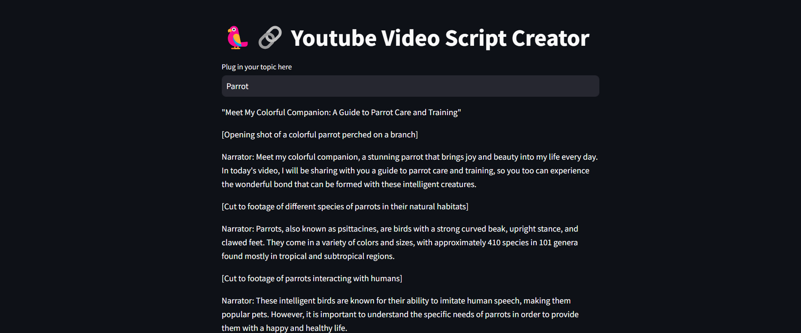

# ScriptGPT
This is a simple YouTube video script creator application that generates video titles and scripts based on user-provided topics, leveraging the power of the OpenAI GPT-3.5 model.



## Features

- Generate creative and engaging YouTube video titles.
- Generate detailed video scripts based on the provided title and Wikipedia research.
- Maintain conversation history and memory for improved context and coherence.

## Installation

1. Install the required dependencies:

   ```shell
   pip install -r requirements.txt
   ```

2. Set up your OpenAI API credentials by creating a `.env` file and adding the following lines:

   ```
   OPENAI_API_KEY=your-api-key
   ```

3. Run the application:

   ```shell
   streamlit run app.py
   ```

## Usage

1. Access the application through `http://localhost:8501`.

2. Enter a topic in the text input to generate a YouTube video title and script.

3. The generated title, script, conversation history, and Wikipedia research will be displayed in the corresponding sections.

4. Explore different topics and generate unique video content.